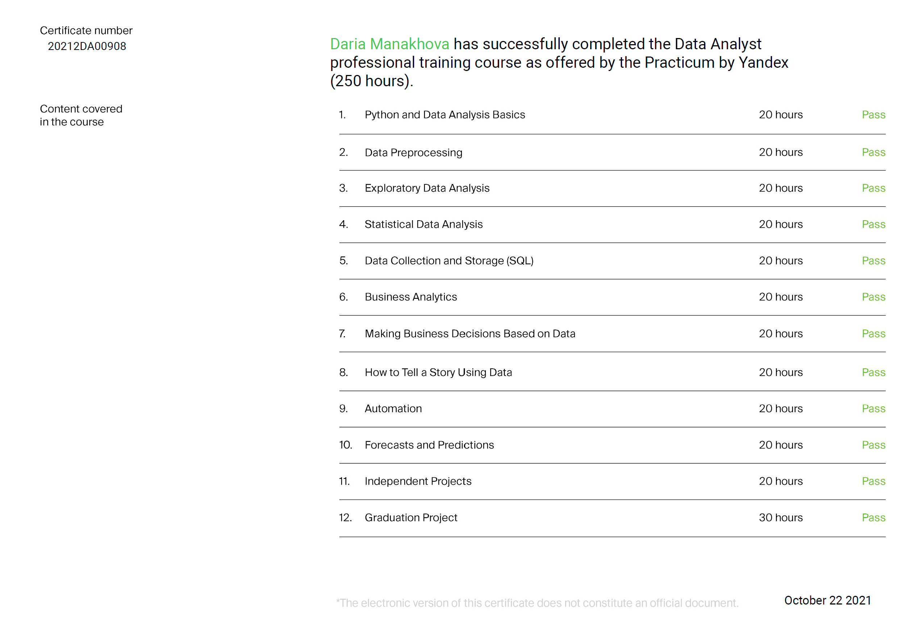

# Yandex.Practicum: Data Analyst
Projects for the course in Yandex School of Data Analysis

Course Link: https://prakticum.yandex.ru/data-analyst/

## Course Programm:

## Certificate ([PDF-file](certificate/daria_manakhova_20212da00908.pdf)):

## Descriptions of Projects:
| № | Название проекта и ссылка | Описание проекта                                                     |Используемые библиотеки   |            
|---------------|-------------------|------------------------------------------------------------------|------------------------------|
|1              |[Исследование данных сервиса “Яндекс.Музыка”](https://nbviewer.org/github/manakhovad/Yandex.Practicum_Data_Analyst/blob/main/01.%20%D0%98%D1%81%D1%81%D0%BB%D0%B5%D0%B4%D0%BE%D0%B2%D0%B0%D0%BD%D0%B8%D0%B5%20%D0%B4%D0%B0%D0%BD%D0%BD%D1%8B%D1%85%20%D1%81%D0%B5%D1%80%D0%B2%D0%B8%D1%81%D0%B0%20%E2%80%9C%D0%AF%D0%BD%D0%B4%D0%B5%D0%BA%D1%81.%D0%9C%D1%83%D0%B7%D1%8B%D0%BA%D0%B0%E2%80%9D/Project_01.ipynb)|Сравниваем, что и в каком режиме слушают жители. Исследуем предпочтения и поведение пользователей Яндекс.Музыки|
|2              |[Исследование надежности заемщиков](https://nbviewer.org/github/manakhovad/Yandex.Practicum_Data_Analyst/blob/main/02.%20%D0%98%D1%81%D1%81%D0%BB%D0%B5%D0%B4%D0%BE%D0%B2%D0%B0%D0%BD%D0%B8%D0%B5%20%D0%BD%D0%B0%D0%B4%D1%91%D0%B6%D0%BD%D0%BE%D1%81%D1%82%D0%B8%20%D0%B7%D0%B0%D1%91%D0%BC%D1%89%D0%B8%D0%BA%D0%BE%D0%B2/Project_02.ipynb)|Разбираемся, влияет ли семейное положение и количество детей клиента на факт погашения кредита в срок. Входные данные от банка — статистика о платёжеспособности клиентов|
Python

Pandas
|
|3              |[Исследование объявлений о продаже квартир](https://nbviewer.org/github/manakhovad/Yandex.Practicum_Data_Analyst/blob/main/03.%20%D0%90%D0%BD%D0%B0%D0%BB%D0%B8%D0%B7%20%D1%80%D1%8B%D0%BD%D0%BA%D0%B0%20%D0%BD%D0%B5%D0%B4%D0%B2%D0%B8%D0%B6%D0%B8%D0%BC%D0%BE%D1%81%D1%82%D0%B8%20%D0%B2%20%D0%A1%D0%B0%D0%BD%D0%BA%D1%82-%D0%9F%D0%B5%D1%82%D0%B5%D1%80%D0%B1%D1%83%D1%80%D0%B3%D0%B5/Project_03.ipynb)| У нас есть архив объявлений о продаже квартир в Санкт-Петербурге и соседних населённых пунктов за несколько лет. Определяем рыночную стоимость объектов недвижимости|
|4              |[Определение перспективного тарифа для телеком-компании](https://nbviewer.org/github/manakhovad/Yandex.Practicum_Data_Analyst/blob/main/04.%20%D0%9E%D0%BF%D1%80%D0%B5%D0%B4%D0%B5%D0%BB%D0%B5%D0%BD%D0%B8%D0%B5%20%D0%B2%D1%8B%D0%B3%D0%BE%D0%B4%D0%BD%D0%BE%D0%B3%D0%BE%20%D1%82%D0%B0%D1%80%D0%B8%D1%84%D0%B0%20%D0%B4%D0%BB%D1%8F%20%D1%82%D0%B5%D0%BB%D0%B5%D0%BA%D0%BE%D0%BC%20%D0%BA%D0%BE%D0%BC%D0%BF%D0%B0%D0%BD%D0%B8%D0%B8/Project_04.ipynb)|Делаем предварительный анализ тарифов на небольшой выборке клиентов. В распоряжении есть данные 500 пользователей. Нужно проанализировать поведение клиентов и сделать вывод — какой тариф лучше|
|5              |[Сборный проект 1. Прогноз продаж интернет-магазина компьютерных игр](https://nbviewer.org/github/manakhovad/Yandex.Practicum_Data_Analyst/blob/main/05.%20%D0%A1%D0%B1%D0%BE%D1%80%D0%BD%D1%8B%D0%B9%20%D0%BF%D1%80%D0%BE%D0%B5%D0%BA%D1%821%20%E2%80%94%20%D0%98%D0%B7%D1%83%D1%87%D0%B5%D0%BD%D0%B8%D0%B5%20%D0%B7%D0%B0%D0%BA%D0%BE%D0%BD%D0%BE%D0%BC%D0%B5%D1%80%D0%BD%D0%BE%D1%81%D1%82%D0%B5%D0%B9%2C%20%D0%BE%D0%BF%D1%80%D0%B5%D0%B4%D0%B5%D0%BB%D1%8F%D1%8E%D1%89%D0%B8%D1%85%20%D1%83%D1%81%D0%BF%D0%B5%D1%88%D0%BD%D0%BE%D1%81%D1%82%D1%8C%20%D0%B8%D0%B3%D1%80/Total_Project_1_Project_05.ipynb)|Выявляем определяющие успешность игры закономерности. Это позволит сделать ставку на потенциально популярный продукт и спланировать рекламные кампании|
|6              |[Аналитика в авиакомпании](https://nbviewer.org/github/manakhovad/Yandex.Practicum_Data_Analyst/blob/main/06.%20%D0%90%D0%BD%D0%B0%D0%BB%D0%B8%D1%82%D0%B8%D0%BA%D0%B0%20%D0%B2%20%D0%B0%D0%B2%D0%B8%D0%B0%D0%BA%D0%BE%D0%BC%D0%BF%D0%B0%D0%BD%D0%B8%D0%B8/Project_06.ipynb)|Изучаем базу данных и анализируем спрос пассажиров на рейсы в города, где проходят крупнейшие фестивали|
|7              |[Анализ бизнес-показателей сервиса "Яндекс.Афиша"](https://nbviewer.org/github/manakhovad/Yandex.Practicum_Data_Analyst/blob/main/07.%20%D0%90%D0%BD%D0%B0%D0%BB%D0%B8%D0%B7%20%D0%B1%D0%B8%D0%B7%D0%BD%D0%B5%D1%81-%D0%BF%D0%BE%D0%BA%D0%B0%D0%B7%D0%B0%D1%82%D0%B5%D0%BB%D0%B5%D0%B9%20%D1%81%D0%B5%D1%80%D0%B2%D0%B8%D1%81%D0%B0%20%E2%80%9C%D0%AF%D0%BD%D0%B4%D0%B5%D0%BA%D1%81.%D0%90%D1%84%D0%B8%D1%88%D0%B0%E2%80%9D/Project_07.ipynb)|Мы на стажировке в отдел аналитики Яндекс.Афиши. Первое задание: помочь маркетологам оптимизировать маркетинговые затраты|
|8              |[Принятие решений в бизнесе на основе данных](https://nbviewer.org/github/manakhovad/Yandex.Practicum_Data_Analyst/blob/main/08.%20%D0%9F%D1%80%D0%B8%D0%BD%D1%8F%D1%82%D0%B8%D0%B5%20%D1%80%D0%B5%D1%88%D0%B5%D0%BD%D0%B8%D0%B8%CC%86%20%D0%B2%20%D0%B1%D0%B8%D0%B7%D0%BD%D0%B5%D1%81%D0%B5%20%D0%BD%D0%B0%20%D0%BE%D1%81%D0%BD%D0%BE%D0%B2%D0%B5%20%D0%B4%D0%B0%D0%BD%D0%BD%D1%8B%D1%85/Project_08.ipynb)|В этом проекте мы приоритизируем гипотезы, запускаем A/B-тест и анализируем результаты|
|9              |[Исследование рынка заведений общественного питания Москвы](https://nbviewer.org/github/manakhovad/Yandex.Practicum_Data_Analyst/blob/main/09.%20%D0%98%D1%81%D1%81%D0%BB%D0%B5%D0%B4%D0%BE%D0%B2%D0%B0%D0%BD%D0%B8%D1%8F%20%D1%80%D1%8B%D0%BD%D0%BA%D0%B0%20%D0%BE%D0%B1%D1%89%D0%B5%D0%BF%D0%B8%D1%82%D0%B0%20%D0%B2%20%D0%9C%D0%BE%D1%81%D0%BA%D0%B2%D0%B5%20%D0%B4%D0%BB%D1%8F%20%D0%BF%D1%80%D0%B8%D0%BD%D1%8F%D1%82%D0%B8%D1%8F%20%D1%80%D0%B5%D1%88%D0%B5%D0%BD%D0%B8%D1%8F%20%D0%BE%D0%B1%20%D0%BE%D1%82%D0%BA%D1%80%D1%8B%D1%82%D0%B8%D0%B8%20%D0%BD%D0%BE%D0%B2%D0%BE%D0%B3%D0%BE%20%D0%B7%D0%B0%D0%B2%D0%B5%D0%B4%D0%B5%D0%BD%D0%B8%D1%8F/Project_09.ipynb) / [Презентация](https://github.com/manakhovad/Yandex.Practicum_Data_Analyst/blob/main/09.%20%D0%98%D1%81%D1%81%D0%BB%D0%B5%D0%B4%D0%BE%D0%B2%D0%B0%D0%BD%D0%B8%D1%8F%20%D1%80%D1%8B%D0%BD%D0%BA%D0%B0%20%D0%BE%D0%B1%D1%89%D0%B5%D0%BF%D0%B8%D1%82%D0%B0%20%D0%B2%20%D0%9C%D0%BE%D1%81%D0%BA%D0%B2%D0%B5%20%D0%B4%D0%BB%D1%8F%20%D0%BF%D1%80%D0%B8%D0%BD%D1%8F%D1%82%D0%B8%D1%8F%20%D1%80%D0%B5%D1%88%D0%B5%D0%BD%D0%B8%D1%8F%20%D0%BE%D0%B1%20%D0%BE%D1%82%D0%BA%D1%80%D1%8B%D1%82%D0%B8%D0%B8%20%D0%BD%D0%BE%D0%B2%D0%BE%D0%B3%D0%BE%20%D0%B7%D0%B0%D0%B2%D0%B5%D0%B4%D0%B5%D0%BD%D0%B8%D1%8F/mow_rest_1.pdf)|Открываем кафе — оно оригинальное, гостей должны обслуживать роботы. Вместе с партнёрами мы решились обратиться к инвесторам. Их интересует текущее положение дел на рынке — сможете ли вы снискать популярность на долгое время, когда все зеваки насмотрятся на роботов-официантов?|
|10             |[Сборный проект 2.  Анализ пользовательского поведения в мобильном приложении](https://nbviewer.org/github/manakhovad/Yandex.Practicum_Data_Analyst/blob/main/10.%20%D0%A1%D0%B1%D0%BE%D1%80%D0%BD%D1%8B%D0%B9%20%D0%BF%D1%80%D0%BE%D0%B5%D0%BA%D1%82%202%20%E2%80%94%20%D0%90%D0%BD%D0%B0%D0%BB%D0%B8%D0%B7%20%D0%BF%D0%BE%D0%BB%D1%8C%D0%B7%D0%BE%D0%B2%D0%B0%D1%82%D0%B5%D0%BB%D1%8C%D1%81%D0%BA%D0%BE%D0%B3%D0%BE%20%D0%BF%D0%BE%D0%B2%D0%B5%D0%B4%D0%B5%D0%BD%D0%B8%D1%8F%20%D0%B2%20%D0%BC%D0%BE%D0%B1%D0%B8%D0%BB%D1%8C%D0%BD%D0%BE%D0%BC%20%D0%BF%D1%80%D0%B8%D0%BB%D0%BE%D0%B6%D0%B5%D0%BD%D0%B8%D0%B8/Total_Project_2_Project_10.ipynb)|Разбираемся, как ведут себя пользователи нашего мобильного приложения. Изучаем воронку продаж. Узнаем, как пользователи доходят до покупки|
|11             |[Создание дашборда по пользовательским событиям для агрегатора новостей "Яндекс.Дзэн"](https://nbviewer.org/github/manakhovad/Yandex.Practicum_Data_Analyst/blob/main/11.%20%D0%A1%D0%BE%D0%B7%D0%B4%D0%B0%D0%BD%D0%B8%D0%B5%20%D0%B4%D0%B0%D1%88%D0%B1%D0%BE%D1%80%D0%B4%D0%B0%20%D0%BF%D0%BE%20%D0%BF%D0%BE%D0%BB%D1%8C%D0%B7%D0%BE%D0%B2%D0%B0%D1%82%D0%B5%D0%BB%D1%8C%D1%81%D0%BA%D0%B8%D0%BC%20%D1%81%D0%BE%D0%B1%D1%8B%D1%82%D0%B8%D1%8F%D0%BC%20%D0%B4%D0%BB%D1%8F%20%D0%B0%D0%B3%D1%80%D0%B5%D0%B3%D0%B0%D1%82%D0%BE%D1%80%D0%B0%20%D0%BD%D0%BE%D0%B2%D0%BE%D1%81%D1%82%D0%B5%D0%B9/Project_11.ipynb)|Строим дата-пайплайны, запускаем скрипты, составляем агрегирующие таблицы и верстаем пайплайн|
|12             |[Прогноз для разработки стратегии взаимодействия с клиентами на основе аналитических данных](https://nbviewer.org/github/manakhovad/Yandex.Practicum_Data_Analyst/blob/main/12.%20%D0%9F%D1%80%D0%BE%D0%B3%D0%BD%D0%BE%D0%B7%D0%B8%D1%80%D0%BE%D0%B2%D0%B0%D0%BD%D0%B8%D0%B5%20%D0%B2%D0%B5%D1%80%D0%BE%D1%8F%D1%82%D0%BD%D0%BE%D1%81%D1%82%D0%B8%20%D0%BE%D1%82%D1%82%D0%BE%D0%BA%D0%B0%20%D0%BF%D0%BE%D0%BB%D1%8C%D0%B7%D0%BE%D0%B2%D0%B0%D1%82%D0%B5%D0%BB%D0%B5%D0%B9%20%D0%B4%D0%BB%D1%8F%20%D1%84%D0%B8%D1%82%D0%BD%D0%B5%D1%81-%D1%86%D0%B5%D0%BD%D1%82%D1%80%D0%BE%D0%B2/Project_12.ipynb)|Наша задача — провести анализ и подготовить план действий по удержанию клиентов и научиться прогнозировать вероятность оттока|

## Final Projects: 2-Weeks Bootcamp

| № | Название проекта и ссылка | Описание проекта                                                     |
|---------------|-------------------|------------------------------------------------------------------|
|1              |[Сегментация пользователей по потреблению для разработки стратегии взаимодействия с клиентами](https://nbviewer.org/github/manakhovad/Yandex.Practicum_Data_Analyst/blob/main/13.%20%D0%92%D1%8B%D0%BF%D1%83%D1%81%D0%BA%D0%BD%D0%BE%D0%B9%20%D0%BF%D1%80%D0%BE%D0%B5%D0%BA%D1%82%20%E2%80%94%20%D0%A1%D0%B5%D0%B3%D0%BC%D0%B5%D0%BD%D1%82%D0%B0%D1%86%D0%B8%D1%8F%20%D0%BF%D0%BE%D0%BB%D1%8C%D0%B7%D0%BE%D0%B2%D0%B0%D1%82%D0%B5%D0%BB%D0%B5%D0%B9%20%D0%BF%D0%BE%20%D0%BF%D0%BE%D1%82%D1%80%D0%B5%D0%B1%D0%BB%D0%B5%D0%BD%D0%B8%D1%8E%20%D0%B4%D0%BB%D1%8F%20%D1%80%D0%B0%D0%B7%D1%80%D0%B0%D0%B1%D0%BE%D1%82%D0%BA%D0%B8%20%D1%81%D1%82%D1%80%D0%B0%D1%82%D0%B5%D0%B3%D0%B8%D0%B8%20%D0%B2%D0%B7%D0%B0%D0%B8%D0%BC%D0%BE%D0%B4%D0%B5%D0%B9%D1%81%D1%82%D0%B2%D0%B8%D1%8F%20%D1%81%20%D0%BA%D0%BB%D0%B8%D0%B5%D0%BD%D1%82%D0%B0%D0%BC%D0%B8/Final_Project_Project_13.ipynb) / [Презентация](https://github.com/manakhovad/Yandex.Practicum_Data_Analyst/blob/main/13.%20%D0%92%D1%8B%D0%BF%D1%83%D1%81%D0%BA%D0%BD%D0%BE%D0%B9%20%D0%BF%D1%80%D0%BE%D0%B5%D0%BA%D1%82%20%E2%80%94%20%D0%A1%D0%B5%D0%B3%D0%BC%D0%B5%D0%BD%D1%82%D0%B0%D1%86%D0%B8%D1%8F%20%D0%BF%D0%BE%D0%BB%D1%8C%D0%B7%D0%BE%D0%B2%D0%B0%D1%82%D0%B5%D0%BB%D0%B5%D0%B9%20%D0%BF%D0%BE%20%D0%BF%D0%BE%D1%82%D1%80%D0%B5%D0%B1%D0%BB%D0%B5%D0%BD%D0%B8%D1%8E%20%D0%B4%D0%BB%D1%8F%20%D1%80%D0%B0%D0%B7%D1%80%D0%B0%D0%B1%D0%BE%D1%82%D0%BA%D0%B8%20%D1%81%D1%82%D1%80%D0%B0%D1%82%D0%B5%D0%B3%D0%B8%D0%B8%20%D0%B2%D0%B7%D0%B0%D0%B8%D0%BC%D0%BE%D0%B4%D0%B5%D0%B9%D1%81%D1%82%D0%B2%D0%B8%D1%8F%20%D1%81%20%D0%BA%D0%BB%D0%B8%D0%B5%D0%BD%D1%82%D0%B0%D0%BC%D0%B8/Final_Project_Bank%20(Manakhova).pdf)|...|
|2              |[Международный интернет-магазин. Оценка результатов A/B-теста](https://nbviewer.org/github/manakhovad/Yandex.Practicum_Data_Analyst/blob/main/14.%20%D0%92%D1%8B%D0%BF%D1%83%D1%81%D0%BA%D0%BD%D0%BE%D0%B9%20%D0%BF%D1%80%D0%BE%D0%B5%D0%BA%D1%82%20%E2%80%94%20%D0%9C%D0%B5%D0%B6%D0%B4%D1%83%D0%BD%D0%B0%D1%80%D0%BE%D0%B4%D0%BD%D1%8B%D0%B9%20%D0%B8%D0%BD%D1%82%D0%B5%D1%80%D0%BD%D0%B5%D1%82-%D0%BC%D0%B0%D0%B3%D0%B0%D0%B7%D0%B8%D0%BD%20%28AB-test%29/Final_AB-Test_Project_14.ipynb)|...|
|3              |[Мини-проект по SQL](https://nbviewer.org/github/manakhovad/Yandex.Practicum_Data_Analyst/blob/main/15.%20%D0%92%D1%8B%D0%BF%D1%83%D1%81%D0%BA%D0%BD%D0%BE%D0%B9%20%D0%BF%D1%80%D0%BE%D0%B5%D0%BA%D1%82%20%E2%80%94%20%D0%9C%D0%B8%D0%BD%D0%B8-%D0%BF%D1%80%D0%BE%D0%B5%D0%BA%D1%82%20%D0%BF%D0%BE%20SQL/Final_SQL_Project_15.ipynb)| ...|